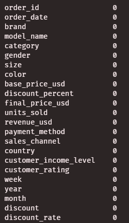
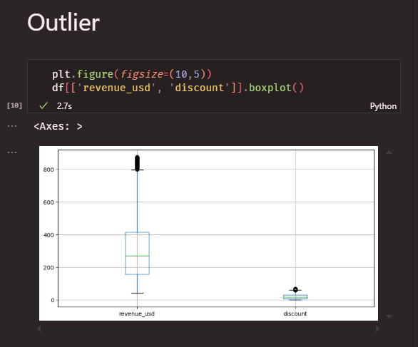

# Footware Sales Data

#### This contains sales data from 5 major brands from the year 2018 to 2026

&nbsp;

# **The steps i took cleaning my data**

&nbsp;

## - Missing

I ran the code `df.isna().sum()` to look for missing values and also to get how many missing values they are in each column and i got this:

#### **which signifies that no data is missing**

&nbsp;

## - Duplicates

after checking for missing values, i decide to check if any data is duplicated in the datasets

i ran this code `df.duplicated().sum()` and i got "zero"

## - Outliers

since i discovered that the dataset was neither missing nor dupicated, i decide to dig more to find out if there are any "Outliers".

meaning is that, i am checking if there is anything odd in the datasets

now if you noticed in the boxplot **revenue_usd** and **discount** had dots or black circles, this is because this two contain outliers

when checking, i noticed that they are dataset that had higher revenue_usd that started from the minimum of $200 to the maximum of $219 while discount started from the minimum of 60 

&nbsp;

# Insights

### 1) I found out that that Asics made more revenue than any other brand in the last 8 years

&nbsp;

### 2) Customers with low level income brought in more sales than customers customers from high and medium level 

&nbsp;

### 3) i found out that across all brands sales, women bought more of shoes from lifestyle, basketball, running and gym categories, while men bought more of shoes from the training category

&nbsp;

### 4) Across sales channel, both retail store and online store brought in the same sales volume but with a difference of $190.05, 

### which made retail store the only sales channel with the highest sales revenue,

### So i decided to dig deeper to know why customers prefer buying from retail store and found out that it was because of the discount being given out to different sales channel

### meaning that the discount for an online sales channel went up to 201,165% while retail store had 198,800%

### there are more analysis but i will stop here for now... 

&nbsp;

# Thank You